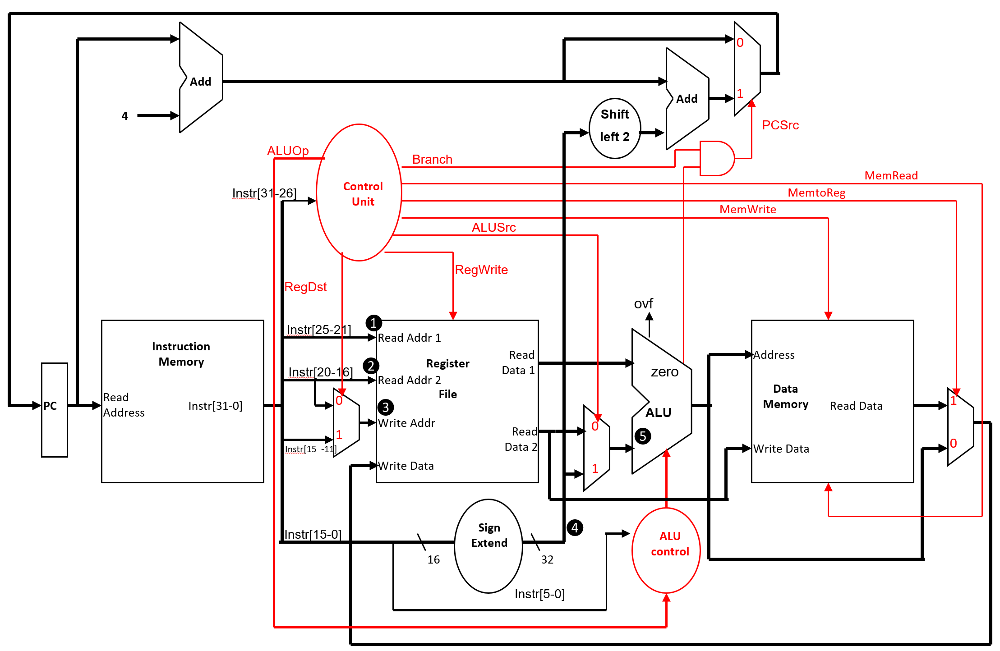

# CS2100 AY2025/26 Sem 1 Midterm Test

Transcribed question-for-question from `CS2100-AY2526-Sem1-Midterm-Test-Answers.pdf`.
Part A: Questions 1–25, multiple choice, 1 mark each. Part B: Questions 26–28, 15 marks in total.
Questions 20–25 share a datapath diagram; it is reproduced in full on each of those questions so that any of them works standalone.

## q1 [medium]

Which of the following is the 8-bit binary signed magnitude sign extension of the 4-bit binary signed magnitude number 1010sm?

A. 10000010sm
B. 10001010sm
C. 11110010sm
D. 11111010sm
E. None of the above

<!-- answer:start -->
exact
A
Option A
<!-- answer:end -->
<!-- explanation:start -->
The value in 4-bit signed magnitude is -2₁₀.
So is A.
<!-- explanation:end -->

## q2 [medium]

Which of the following decimal values is not representable in a 9-bit binary signed magnitude representation?

A. +128
B. -1
C. +290
D. -254
E. None of the above

<!-- answer:start -->
exact
C
Option C
<!-- answer:end -->
<!-- explanation:start -->
Take away the MSB for sign bit, we have 8-bits for values that can range from 0x00 to 0xFF, i.e., 0 to 255. So the most positive representable would be +255 and the most negative representable would be -255.
<!-- explanation:end -->

## q3 [medium]

Suppose Mary has a 32-bit two's complement integer X that she wishes to multiply by 5. Which one of the following sequences of steps would not work? Assume that all intermediate results fit in 32 bits with no overflow.

A. Shift X left by 1 bit to get Y, then shift Y left by 1 bit to get Z and finally add X to Z to get X * 5.
B. Shift X left by 2 bit to get Y, then add X to Y to get X * 5.
C. Shift X left by 3 bit to get Y, then subtract X from Y to get X * 5.
D. Shift X left by 1 bit to get Y, and shift X left by 1 bit to get Z, and finally do X + Y + Z to get X * 5.
E. None of the above

<!-- answer:start -->
exact
C
Option C
<!-- answer:end -->
<!-- explanation:start -->
A. Y = 2X, Z = 4X, X + Z = 5X → works.
B. Y = 4X, X + Y = 5X → works.
C. Y = 8X, Y - X = 7X → does not work.
D. Y = 2X, Z = 2X, X + Y + Z = 5X → works.
<!-- explanation:end -->

## q4 [medium]

Which one of the following correctly states the bases involved in the following arithmetic expression involving unsigned values of their respective bases?

`4090X – 1520Y = 3206Z`

A. X = 10, Y = 7 and Z = 7
B. X = 15, Y = 13 and Z = 8
C. X = 12, Y = 11 and Z = 9
D. X = 11, Y = 13 and Z = 9
E. None of the above

<!-- answer:start -->
exact
D
Option D
<!-- answer:end -->
<!-- explanation:start -->
A   4090₁₀ = 4090
    1520₇ = 602
    3206₇ = 1133
    4090 - 602 = 3488 (!= 1133)

B   4090₁₅ = 13635
    1520₁₃ = 3068
    3206₈ = 1670
    13635 - 3068 = 10567 (!= 1670)

C   4090₁₂ = 7020
    1520₁₁ = 1958
    3206₉ = 2355
    7020 - 1958 = 5062 (!= 2355)

D   4090₁₁ = 5423
    1520₁₃ = 3068
    3206₉ = 2355
    5423 - 3068 = 2355

Hence the answer is D.
<!-- explanation:end -->

## q5 [medium]

Which of the following is the 8-hexadecimal-digit hexadecimal string that represents the floating point value -1.0 (decimal) in the IEEE Standard 754 single precision (32-bit) floating point?

A. 0xbf800000
B. 0xbe800000
C. 0x3f800000
D. 0x3e800000
E. None of the above

<!-- answer:start -->
exact
A
Option A
<!-- answer:end -->
<!-- explanation:start -->
Sign bit is 1.
Exponent is 0. After adding bias, it is 127, or 0x7f.
Mantissa is 0.
Putting it all together, we get
1 | 011 1111 1 | 000 0000 0000 0000 0000 0000₂
which is A.
<!-- explanation:end -->

## q6 [medium]

Bob wrote the following code while studying the IEEE Standard 754 single precision (32-bit) floating point:

```c
#include <stdio.h>

union {
    unsigned int i;
    float f;
} u;

void plusConvert(int i)
{
    u.f = (float)i; // Convert to IEEE single precision
    printf("1. i = 0x%x (%d): 0x%x %e\n", i, i, u.i, u.f);

    i++;

    u.f = (float)i; // Convert to IEEE single precision
    printf("2. i = 0x%x (%d): 0x%x %e\n\n", i, i, u.i, u.f);
}

int main(int argc, char *argv[])
{
    int X = <some value>;

    plusConvert(X);
}
```

The function plusConvert() takes a 32-bit two's complement integer as an argument, X, and converts it into a IEEE Standard 754 single precision (32-bit) floating point number using C's type casting and "round to zero" (which simply discards any extra bits). He then use a union to print out the exact bits of the converted floating point value. Let's call this f(X). To his surprise, he found that if he does the same with X+1, (let's call this f(X+1) – note that the 1 is added before the conversion to floating point), he found that for some values of X, f(X) is equal to f(X+1) in that the binary representations are identical, even though X ≠ X+1 (as 32-bit two's complement integers). Which of the following integer would be one such possible X? (Note: the numbers below are all in hexadecimals.)

A. X = 0x25a2d87f
B. X = 0x0120101c
C. X = 0x0388922f
D. X = 0x00a66d41
E. None of the above

<!-- answer:start -->
exact
B
Option B
<!-- answer:end -->
<!-- explanation:start -->
This question is a bit more involved. The key insight is that in IEEE 754 32-bit binary floating point format, the mantissa (excluding the implicit 1) is only 23 bits. This means that it cannot represent all the 32-bit integers. In particular, it depends on the spread of 1's and not just the magnitude. So, for example, the (positive) integer 0110 0000 0000 0000 0000 0000 0000 0000₂ (32 bits) can still be represented exactly as 1.1 x 2³⁰. But in trying to represent say 0110 0000 0000 0000 0000 0000 0000 1111₂ (32 bits), we will be forced to drop the last 4 1's simply because we do not have 32 bits for our mantissa, and that will result in the phenomenon described in the question.
So if we expand each of the numbers, we find that:

A    = 0x25a2d87f = 0010 0101 1010 0010 1101 1000 0111₂
A+1 = 0x25a2d880 = 0010 0101 1010 0010 1101 1000 1000₂

B   = 0x0120101c = 0000 0001 0010 0000 0001 0000 0001 1100₂
B+1 = 0x0120101d = 0000 0001 0010 0000 0001 0000 0001 1101₂

C   = 0x0388922f = 0000 0011 1000 1000 1001 0010 0010 1111₂
C+1 = 0x03889230 = 0000 0011 1000 1000 1001 0010 0011 0000₂

D   = 0x00a66d41 = 0000 0000 1010 0110 0110 1101 0100 0001₂
D+1 = 0x00a66d42 = 0000 0000 1010 0110 0110 1101 0100 0010₂

The underlined bits are the 23 bits that make it into the mantissa, the bit in bold being the least significant one of these. You can see that the two values for B and B+1 results in the same 23 bits in the mantissa.
<!-- explanation:end -->

## q7 [medium]

Which of the following is a valid C initialization statement (i.e., no compilation warning or error and code will run accordingly)?

```c
A. struct {
      int x;
      char s[3];
      int y;
   } stu = {,"abc"};
B. struct {
      int x;
      char s[3];
      int y;
   } stu = {1, "abcd"};
C. struct {
      int x;
      char s[3];
      int y;
   } stu = {1, "abc"};
D. struct {
      int x;
      char s[3];
      int y;
   } stu = {1, "abc", 2, 3};
E. None of the above
```

<!-- answer:start -->
exact
C
Option C
<!-- answer:end -->
<!-- explanation:start -->
A has a missing initializer before the comma, which is invalid.
B initializes char s[3] with "abcd", a 5-byte string, which does not fit.
C initializes int x = 1, char s[3] = "abc" and leaves int y zero-filled – valid.
D supplies more initializers than there are members.
<!-- explanation:end -->

## q8 [medium]

Which of the following is a valid C if statement (i.e., no compilation warning or error, and the code will run accordingly), assuming the body of the loop (indicated as "...") is all good? We will assume that any variable referred to here is properly defined.

A. `if () {...}`
B. `if (;) {...}`
C. `if (i;) {...}`
D. `if (i?0:1) {...}`
E. None of the above

<!-- answer:start -->
exact
D
Option D
<!-- answer:end -->
<!-- explanation:start -->
A has an empty condition, B and C contain a stray semicolon inside the parentheses, all of which are syntax errors. D is a valid conditional expression whose value (0 or 1) is a perfectly legal controlling expression.
<!-- explanation:end -->

## q9 [medium]

Consider the following C snippet:

```c
#include <stdio.h>

int main(int argc, char *argv[])
{
    for (int i=0; i<10; i++)
        printf("%d ", ++i);
}
```

What output would be printed out at the terminal after compiling and executing this C loop?

A. 1 3 5 7 9
B. 1 2 4 8 9
C. 0 2 4 6 8
D. 1 2 3 4 5 6 7 8 9
E. None of the above

<!-- answer:start -->
exact
A
Option A
<!-- answer:end -->
<!-- explanation:start -->
i is incremented twice per iteration: once by the pre-increment inside the printf, and once by the loop's post-increment. i takes the values 0, 2, 4, 6, 8 at the top of the loop and prints 1, 3, 5, 7, 9; the next test 10 < 10 fails.
<!-- explanation:end -->

## q10 [medium]

Consider the following C program:

```c
#include <stdio.h>

int main(int argc, char *argv[])
{
    int i;

    i = 5;
    do {
        printf("%d ", i--);
    } while (--i && i>0);
}
```

What output would be printed out at the terminal after compiling and executing this program?

A. 4 2 0
B. 5 3 1
C. 4 3 2 1 0
D. 5 4 3 2 1
E. None of the above

<!-- answer:start -->
exact
B
Option B
<!-- answer:end -->
<!-- explanation:start -->
First pass: print 5 (i becomes 4), then --i makes i = 3, 3 is non-zero and > 0, so loop again.
Second pass: print 3 (i becomes 2), then --i makes i = 1, loop again.
Third pass: print 1 (i becomes 0), then --i makes i = -1, -1 is non-zero but i > 0 is false, so stop.
Output: 5 3 1.
<!-- explanation:end -->

## q11 [medium]

Consider the following C code:

```c
#include <stdio.h>

int A[4] = {1, 2, 3, 4};

int main(int argc, char *argv[])
{
    int *p[2], **q;

    p[0] = &(A[0]);
    p[1] = &(A[2]);
    q = p;

    *q = &(A[1]);
    **q++ = 100;

    printf("%d %d %d %d\n",
            A[0], A[1], A[2], A[3]);
}
```

What is the output printed to the terminal after compiling and executing this program?

A. 1 2 3 4
B. 1 2 3 5
C. 1 100 3 4
D. 1 2 3 100
E. None of the above

<!-- answer:start -->
exact
C
Option C
<!-- answer:end -->
<!-- explanation:start -->
*q = &(A[1]) makes p[0] point to A[1]. Then **q++ = 100 writes 100 through p[0] (because the ++ is post-increment: the value being dereferenced is still p[0]), so A[1] becomes 100; q is then advanced to p[1]. A[2] and A[3] are untouched.
Output: 1 100 3 4.
<!-- explanation:end -->

## q12 [medium]

Consider the following C code:

```c
#include <stdio.h>

int A[4] = {1, 2, 3, 4};

int main(int argc, char *argv[])
{
    int *p[2], **q;

    p[0] = &(A[0]);
    p[1] = &(A[2]);
    q = p;

    *q = &(A[1]);
    **q++ = 100;

    printf("%d %d %d %d\n",
            A[0], A[1], A[2], A[3]);
}
```

Assuming the pointers and integers are all 32-bits in length, and the array A in Question 11 is stored at location 0x1000 while the array p is in location 0x5000. What would be the value of *q (note not q itself) just before the printf() statement in the above code?

A. 0x1004
B. 0x1008
C. 0x5004
D. 0x5008
E. None of the above

<!-- answer:start -->
exact
B
Option B
<!-- answer:end -->
<!-- explanation:start -->
q is a pointer to a pointer. It's initial value is 0x5000 (address of p). In "**q++", q is incremented. So it will point to the second element of p, which in turn points to A[2] or 0x1008 due to the assignment of p[1] = &(A[2]);.
<!-- explanation:end -->

## q13 [medium]

What is the hexadecimal encoding for the following instruction:

`lw $v1, -100($t7)`

A. 0x8c6fff9c
B. 0x8c6fff9d
C. 0x8de3ff9b
D. 0x8de3ff9c
E. None of the above

<!-- answer:start -->
exact
D
Option D
<!-- answer:end -->
<!-- explanation:start -->
lw has opcode 0x23, rs = $t7 = 15, rt = $v1 = 3 and the immediate -100 is 0xFF9C in 16-bit two's complement. Encoding = 0x8DE30000 + 0xFF9C = 0x8DE3FF9C.
<!-- explanation:end -->

## q14 [medium]

The following is the hexadecimal encoding of a branch instruction in MIPS:

`0x12c3fbad`

Assume that this instruction is at PC = 0x5204. What is the target PC if the branch is taken?

A. 0x40b0
B. 0x40b8
C. 0x40bc
D. 0x53b8
E. None of the above

<!-- answer:start -->
exact
C
Option C
<!-- answer:end -->
<!-- explanation:start -->
0xfbad extended to 32-bit gives the constant -1107₁₀. Multiply this by 4, we get -4428₁₀ (-0x114c). Next we add this to PC+4, and we get 0x40bc.
<!-- explanation:end -->

## q15 [medium]

The "move" instruction is a pseudo-instruction. It moves the content of one register to another. Which of the following cannot be used to implement the following pseudo instruction that moves the content of register $r2 to register $r1 because for some inputs, it produces the wrong results?

`move $r1, $r2`

A. `addi $r1, $r2, 0`
B. `andi $r1, $r2, 0xff`
C. `or $r1, $r2, $zero`
D. `sll $r1, $r2, 0`
E. None of the above

<!-- answer:start -->
exact
B
Option B
<!-- answer:end -->
<!-- explanation:start -->
This is because andi will do zero extension of the immediate. The upper half of $r1 will be zero'ed out.
<!-- explanation:end -->

## q16 [medium]

Consider the following MIPS instruction given in hexadecimals:

`0x080000ad`

Assuming that the PC of this instruction is 0x1014, which of the following instructions would be equivalent to this instruction in hexadecimal above? All the numbers below are in decimal.

A. `beq $v0, $v0, -857`
B. `beq $v0, $zero, -1024`
C. `bne $t0, $zero, 173`
D. `bne $zero, $zero, -3428`
E. None of the above

<!-- answer:start -->
exact
A
Option A
<!-- answer:end -->
<!-- explanation:start -->
0x080000ad is j with a 26-bit address field of 0x0000ad; PC+4 = 0x1018 whose upper 4 bits are 0, so the jump target is 0x000000ad x 4 = 0x2B4.
A beq $v0, $v0 always branches (a register always equals itself), and its target is PC + 4 + (-857 x 4) = 0x1018 - 0xD64 = 0x2B4 – the same target. Hence A.
<!-- explanation:end -->

## q17 [medium]

Which sequence(s) of instruction(s) correctly sets bit 9, 12, and bit 15 of $t0 to 1, with the other bits set to 0?

```asm
(i)   ori $t1, $zero, 0x49          (ii)  ori $t0, $zero, 0xff
      sll $t1, $t1, 9                      addi $t0, $t0, 0x9200
      or  $t0, $t0, $t1

(iii) ori $t0, $zero, 0x92          (iv)  lui $t0, 0x124
                                           srl $t0, $t0, 9
                                           add $t0, $t0, $t0
```

A. Only (i) and (ii).
B. Only (ii) and (iii).
C. Only (i), and (iv).
D. Only (iv).
E. None of the above.

<!-- answer:start -->
exact
E
Option E
<!-- answer:end -->
<!-- explanation:start -->
The problem with (i) is while the bit pattern is correct in $t1 (0x9200), the value currently in $t0 is unknown and hence cannot reliably produce the result we want.

(ii) will produce 0xffff92ff due to the sign extension of 0x9200 in the addi.

(iii) uses the wrong constant – it should be 0x9200.

(iv) is totally off, producing 0x12400.

Hence, "none of the above".
<!-- explanation:end -->

## q18 [medium]

A sender transmits a 32-bit word composed of 31 data bits followed by 1 odd parity bit. The parity is computed over all 31 data bits. The sender is big-endian and the receiver is little-endian. Assuming no transmission errors, which 32-bit data chunks, represented in hexadecimal, will be accepted without a parity error by the receiver?

A. 0x752d6298
B. 0x1ab8407a
C. 0xb3fdf0cb
D. All of the above
E. None of the above

<!-- answer:start -->
exact
D
Option D
<!-- answer:end -->
<!-- explanation:start -->
Option A has 15 ones.
Option B has 13 ones.
Option C has 21 ones.
Hence all satisfies odd parity.
<!-- explanation:end -->

## q19 [medium]

What would be the main drawback of an aggressively designed expanding opcode scheme?

A. The instruction decoding logic would be complex.
B. Difficult for users to use.
C. Cannot do memory addressing.
D. All of the above.
E. None of the above

<!-- answer:start -->
exact
A
Option A
<!-- answer:end -->
<!-- explanation:start -->
Each extra tier of opcode means the decoder has to inspect more fields and chain more decisions, so the decoding logic becomes complex.
<!-- explanation:end -->

## q20 [medium]

Questions 20–25 use the following datapath diagram and these assumptions:

- The instruction being executed is: `add $t4, $v0, $s1`
- The contents of the registers involved are:
  - $t4 = 0x100
  - $v0 = 0x200
  - $s1 = 0x300



What is the value at the position marked ❶ in the diagram? All values below are in decimal.

A. 2
B. 12
C. 17
D. 20
E. None of the above

<!-- answer:start -->
exact
A
Option A
<!-- answer:end -->
<!-- explanation:start -->
❶ is the Read Addr 1 input of the register file, i.e. rs. rs is $v0 or register 2.
<!-- explanation:end -->

## q21 [medium]

Questions 20–25 use the following datapath diagram and these assumptions:

- The instruction being executed is: `add $t4, $v0, $s1`
- The contents of the registers involved are:
  - $t4 = 0x100
  - $v0 = 0x200
  - $s1 = 0x300


What is the value at the position marked ❷ in the diagram? All values below are in decimal.

A. 2
B. 12
C. 17
D. 20
E. None of the above

<!-- answer:start -->
exact
C
Option C
<!-- answer:end -->
<!-- explanation:start -->
❷ is the Read Addr 2 input of the register file, i.e. rt. rt is $s1 or register 17.
<!-- explanation:end -->

## q22 [medium]

Questions 20–25 use the following datapath diagram and these assumptions:

- The instruction being executed is: `add $t4, $v0, $s1`
- The contents of the registers involved are:
  - $t4 = 0x100
  - $v0 = 0x200
  - $s1 = 0x300


What is the value at the position marked ❸ in the diagram? All values below are in decimal.

A. 2
B. 12
C. 17
D. 20
E. None of the above

<!-- answer:start -->
exact
B
Option B
<!-- answer:end -->
<!-- explanation:start -->
❸ is the Write Addr input of the register file, i.e. rd. rd is $t4 or register 12.
<!-- explanation:end -->

## q23 [medium]

Questions 20–25 use the following datapath diagram and these assumptions:

- The instruction being executed is: `add $t4, $v0, $s1`
- The contents of the registers involved are:
  - $t4 = 0x100
  - $v0 = 0x200
  - $s1 = 0x300


What is the value at the position marked ❹ in the diagram? All values below are in hexadecimal.

A. 0x00000000
B. 0x00006020
C. 0xFFFF6020
D. 0xFFFFFFFF
E. None of the above

<!-- answer:start -->
exact
B
Option B
<!-- answer:end -->
<!-- explanation:start -->
❹ is the output of the sign extend unit. The encoding for the instruction is 0x00516020. The lower 16 bit is fed into the sign extension unit and will produce 0x00006020 – which is then ignored by the ALU because ALUSrc will choose the second register ($s1) read from the register file instead.
<!-- explanation:end -->

## q24 [medium]

Questions 20–25 use the following datapath diagram and these assumptions:

- The instruction being executed is: `add $t4, $v0, $s1`
- The contents of the registers involved are:
  - $t4 = 0x100
  - $v0 = 0x200
  - $s1 = 0x300


What is the value at the position marked ❺ in the diagram? All values below are in hexadecimal.

A. 0x00000000
B. 0x00000100
C. 0x00000200
D. 0x00000300
E. None of the above

<!-- answer:start -->
exact
D
Option D
<!-- answer:end -->
<!-- explanation:start -->
The value of rt goes into the ALU as its second input. rt is $s1 = 0x300.
<!-- explanation:end -->

## q25 [medium]

Questions 20–25 use the following datapath diagram and these assumptions:

- The instruction being executed is: `add $t4, $v0, $s1`
- The contents of the registers involved are:
  - $t4 = 0x100
  - $v0 = 0x200
  - $s1 = 0x300


Which of the following correctly assigns the control signals?

A. RegDst = 0, RegWrite = 0, ALUSrc = 0, MemRead = 0, MemWrite = 0, MemtoReg = 0
B. RegDst = 1, RegWrite = 1, ALUSrc = 0, MemRead = 0, MemWrite = 0, MemtoReg = 0
C. RegDst = 0, RegWrite = 1, ALUSrc = 1, MemRead = 0, MemWrite = 0, MemtoReg = 0
D. RegDst = 0, RegWrite = 1, ALUSrc = 0, MemRead = 0, MemWrite = 0, MemtoReg = 1
E. None of the above

<!-- answer:start -->
exact
B
Option B
<!-- answer:end -->
<!-- explanation:start -->
We need to use rd as the write register. Hence RegDst = 1, also RegWrite = 1.

ALUSrc = 0 so that we feed the second register file output into the ALU second operand instead of the signed extended immediate.

MemRead = MemWrite = 0 since there is no memory operation.

MemtoReg = 0 so that the ALU output, not memory output, goes back to the register file for writing.
<!-- explanation:end -->

## q26 [hard]

As mentioned in Assignment 1, MIPS has a real instruction

`sllv $rx, $ry, $rz`

that performs a logical left shift of $ry by the amount in the lowest 5 bits of $rz and writes the result to $rx. Suppose sllv is unavailable and must be implemented as an assembler pseudo-instruction. Give the instruction sequence an assembler could emit to implement this instruction.

Constraints:

- Use only instructions from the Core Instruction Set of the MIPS Reference Data.
- Only the lowest 5 bits of $rz determine the shift amount (0–31); higher bits in $rz are ignored.
- The contents of $ry and $rz must be preserved throughout the execution.
- Use $at ($1) as the temporary register and avoid using other registers as temporaries if possible.

<!-- answer:start -->
manual
<!-- answer:end -->
<!-- explanation:start -->
```
andi $at, $rz, 0x1F            // Need the least 5 bits of $rz; hex 0x1F of 31₁₀

addi $rx, $ry, 0               // Copy $ry into $rx
LOOP:
beq $at, $zero, OUT            // Are we done?

sll $rx, $rx, 1                // Shift by 1 position
addi $at, $at, -1
j LOOP                         // Loop
OUT:
```
<!-- explanation:end -->

## q27 [hard]

Suppose there is a machine that has 64 registers, and three types of instructions as follows:

Class A instructions: these are 16-bit instructions that take two register operands.

Class B instructions: these are 32-bit instructions that take three register operands as well as a 6-bit shift amount.

Class C instructions: these are 32-bit instructions that take two register operands and a 14-bit immediate operand.

What is the maximum and minimum number of instructions that this machine can have, assuming all classes exist, and the encoding space for opcode is completely utilized?

<!-- answer:start -->
manual
<!-- answer:end -->
<!-- explanation:start -->
Maximum number of instructions: 238

1 Class A instruction (say binary opcode 0000₂), 1 Class C instruction (binary opcode say 0001 00₂), then Class B instructions can go from 0001 01 00₂ (20₁₀) to 1111 11 11₂ (255₁₀), or 255-20+1 = 236 instructions. So the maximum is 236 + 1 + 1 = 238.

Minimum number of instructions: 22

4 Class B instruction (say binary opcode 0000 00 00₂ to 0000 00 11₂). 3 Class C instruction (0000 01₂ to 0000 11₂) and 15 Class A, i.e., 0001₂ to 1111₂. So the minimum is 4 + 3 + 15 = 22.
<!-- explanation:end -->

## q28 [hard]

Referring to the diagram for Question 20 above, and the following table:

| Inst-Mem | Adder | MUX | ALU | Reg-File | Data-Mem | Control / ALU-control | Left-shift / Sign-Extend / AND |
|---|---|---|---|---|---|---|---|
| 400ps | 100ps | 30ps | 120ps | 200ps | 350ps | 100ps | 20ps |


Note that "Adder" and "MUX" refers to any adder (except the ALU) or mux in the diagram.

Give the estimated latency of an "addi" instruction. In your answer, you should identify which column of the above table is used for the computation, and which are not, as well as whether it is on the critical path of the instruction.

<!-- answer:start -->
manual
<!-- answer:end -->
<!-- explanation:start -->
Inst-Mem: On the critical path.

Adder: Not on the critical path.

MUX: On the critical path - twice.

Reg-File: On the critical path - twice.

Data-Mem: Not on the critical path.

Control: Not on the critical path.

Left-shift: Not on the critical path since it is shorter than the parallel operation of reading the register file.

Total latency = 400 (Inst-Mem) + 200 (Reg-File) + 120 (ALU) + 30 (MtoR) + 200 (Reg-File) = 950ps

Total latency: 950ps
<!-- explanation:end -->
